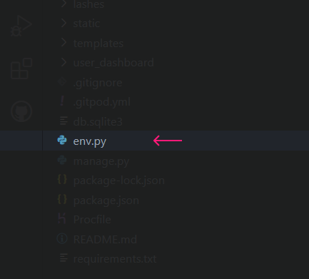

## [Content](#content)
- [Belle Lashhh - Introduction](#belle-lashhh---introduction)
  - [User Experience - UX](#user-experience---ux)
    - [Site Aims](#site-aims)
    - [Agile Methodology](#agile-methodology)
      - [Epics and User Stories](#epics-and-user-stories)
      - [Tasks](#tasks)
  - [Design](#design)
    - [Colours](#colours)
    - [Typography](#typography)
    - [Imagery](#imagery)
    - [Wireframes](#wireframes)
  - [Database Diagram](#database-diagram)
  - [Features](#features)
    - [Home Page](#home-page)
      - [Navbar](#navbar)
      - [Hero Image](#hero-image)
      - [Destination Section](#destination-section)
      - [Footer](#footer)
    - [About Page](#about-page)
    - [Register](#register)
    - [Login](#login)
    - [Logout](#logout)
    - [Bookings](#bookings)
    - [Date picker](#date-picker)
    - [Alert Messages](#alert-messages)      
  - [Admin Panel/Superuser](#admin-panelsuperuser)
  - [Technologies Used](#technologies-used)
    - [Languages Used](#languages-used)
    - [Django Packages](#django-packages)
    - [Frameworks - Libraries - Programs Used](#frameworks---libraries---programs-used)
  - [Testing](#testing)
      - [Validation](#validation)
      - [Manual Testing](#manual-testing)
  - [Bugs](#bugs)
      - [Fixed Bugs](#fixed-bugs)
      - [Unfixed Bugs](#unfixed-bugs)
  - [Deployment](#deployment)
      - [Creating the Django project](#creating-the-django-project)
      - [Creating Heroku app](#creating-heroku-app)
      - [Set up Environment Variables](#set-up-environment-variables)
      - [Heroku deployment](#heroku-deployment)
      - [Final Deployment](#final-deployment)
  - [Credits](#credits)
    - [Content](#content)
    - [Information Sources / Resources](#information-sources--resources)
  - [Acknowledgement](#acknowledgement)

# Bugs

## Fixed Bugs

There was an accidental commit of the <code>env.py</code> file from the early stages of production. Being that this file contains sensitive information, it shouldn't have been commited in the first place, so there is an issue with it being present in the repository. 

First, i tried rebasing, with the following commands:

<code>git checkout main</code>

<code>git log env.py</code>

<code>git rebase -i <commit_hash></code>

An editor appears in the workspace, showing the commit history. Every commit line in this file has the keyword <code>pick</code> in front of it. The way you allow for the file to be deleted, is to change that keyword to <code>edit</code>. After saving the file and closing the editor, the following command is required to continue with the process:

<code>git rm env.py</code>

Finally, to complete the rebase, the command <code>git rebase --continue</code> is required.

This process will remove the file from the commit where it was introduced, as well as from any subsequent commits.

However, the way I solved this issue was by running the following commands:

<code>git filter-branch --index-filter 'git rm --cached --ignore-unmatch env.py' HEAD</code>

Followed by:

<code>git push --force</code>

The file will be removed from all git commit history, as if it never existed on this branch. 

Although, there's a small issue with this solution. Let's say someone has cloned our repo before we got to run the above commands. That means that <code>env.py</code> still lives in another online or offline location and it's a delicacy for our application, as it might expose certain information. If the file exists in a clone of the repo on GitHub, said master branch will show that the origin has had a forced update.

At this point, we want to rewrite the history of commits with the command <code>git merge origin/main</code>. Note that, the file that exists in a remote cloned repo will still exist, but, <strong>the developer(s) owning this repo will face <code>forced push</code> issues when they try to push the code into GitHub</strong>. 
It is recommended that everybody working on the project is advised to delete the current repo and reclone the now merged main branch without the sensitive file. 

This method can be crippling or slowing down the production, however, a workaround to this would be for people who have actually progressed with the project to just move the repo somewhere safe and keep the files they have worked on. After the reclone, the files could be pushed again in the new repo, continuing development.